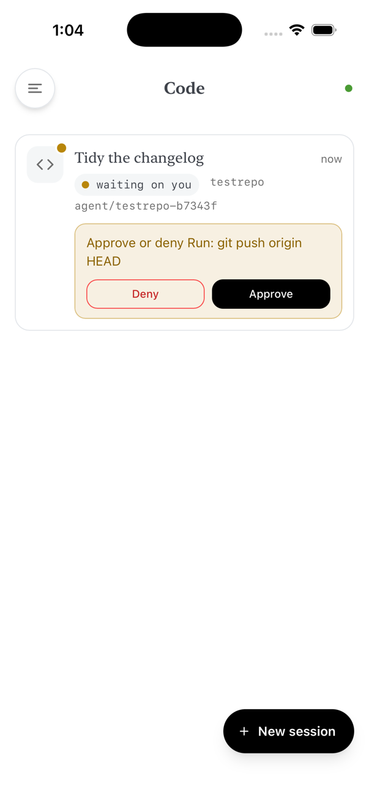
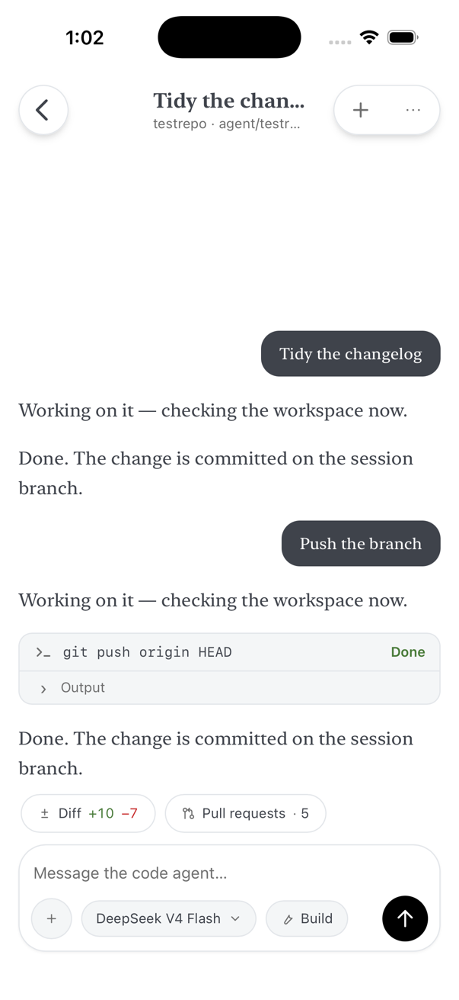
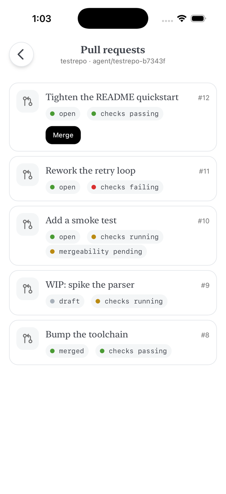

# Goose Mobile

[](https://github.com/PhillipChaffee/goose-phone-app/actions/workflows/ci.yml)
[](https://coveralls.io/github/PhillipChaffee/goose-phone-app?branch=main)
[](LICENSE)

**Talk to your own AI agents from your phone — or your desktop.**

Goose Mobile is a native client for agents running on your own machine — a home
server, a cloud VPS, your desktop. It speaks to two of them:
[goose](https://github.com/aaif-goose/goose), over the Agent Client Protocol on a
WebSocket, and **code agents** — one [OpenCode](https://opencode.ai) container per
chat, fronted by a session manager — over HTTP and SSE. It reaches both privately
over [Tailscale](https://tailscale.com), so nothing is exposed to the public
internet and there is no hosted service in the middle. Written entirely in Rust
with [Dioxus](https://dioxuslabs.com), one codebase builds for **iOS**,
**Android** and the **desktop** — which is the default cargo feature, and the
loop the app is developed in.

<p align="center">
  
  
  
</p>

<sub>The running app, not mock-ups: captures off an iPhone 17 Pro simulator
(`scripts/shoot-simulator.sh <name>`). For markup that cannot drift there is
[`docs/style-gallery.html`](docs/style-gallery.html): twenty-seven screen states
dumped out of the app's own DOM, which is also what `docs/audit.js` reads.</sub>

## Features

- **Full agent chat** — streamed responses rendered as markdown (code blocks, tables, lists), with the agent's reasoning in collapsible sections.
- **Tool visibility and control** — every tool call appears as a card with live status and output, and the agent's permission requests become an approval sheet: allow once, always allow, or reject. A run of two or more settled calls folds to one line, and stays open when anything in it failed or is still running. A code agent blocked on a permission says so on the list, and can be answered from there.
- **Sessions** — browse, resume, and delete your server-side sessions; swipe a row left for its delete tray. History replays through the same rendering path as live output, so a resumed chat looks identical.
- **Attachments** — send a photo, a screenshot or a file with your message, on either tab. The picker is iOS's own (photo library, camera, Files); images are downscaled on the phone so a 12-megapixel camera file does not become a multi-megabyte request over the tailnet, and anything too large or of a type neither agent can read is refused by name rather than dropped.
- **Model, effort and mode, per session** — two chips on the composer, on one line with the send button. One opens a sheet holding whatever that backend can actually change (provider, model, thinking effort); the other picks the mode a turn runs in — goose's own, or an OpenCode agent. Both state a resolved value rather than naming themselves. What cannot change — the context window on either — is stated as a fact instead of being offered as a control that does nothing.
- **Starting a code session** — a composer, not a form: you write the task and the placeholder names what it will run against. Repository, base branch, model and mode are pills above the keyboard, each opening a sheet that filters once the list is long enough to need it. The model is required.
- **Pull requests** — the work a code agent has pushed, listed with its state and check status, and mergeable from the phone when GitHub says it can be.
- **Built for a phone on a flaky network** — Stop cancels a running turn, dropped connections reconnect automatically and replay history, and half-open sockets (the classic "connected but nothing happens" after switching networks) are detected and recovered.
- **Private by default** — reaches your server over your tailnet, authenticated with a shared secret, with optional certificate pinning.
- **Light and dark** — both follow the system, and `node docs/audit.js both` walks every captured screen in each of them for contrast and geometry.
- **Chats and Code** — the drawer's destinations are Chats, Code and Settings. Alongside the goose chats (Chats), Code manages code-agent sessions: per-chat OpenCode containers on your server (one container per chat, spun down when idle, woken when you open them). Start a session against an allowlisted repo with any model, watch it stream, approve its permission asks (including `git push`), review the diff in-app — one collapsible card per file, re-hunked on the device, with reviewed marks — and merge the pull requests its branch has open. Opened chats are cached on-device, so a sleeping chat's transcript appears instantly while its container boots. Server side: [personal-ai-setup `docs/code-agents.md`](https://github.com/PhillipChaffee/personal-ai-setup); client side: issue #2. The protocol layer is [`crates/opencode-client`](crates/opencode-client) (HTTP + SSE via reqwest).

## How it works

```
                    Tailscale (WireGuard)      ┌──────────────────────┐
┌──────────────┐  wss://goose-box.tailnet…/acp │  goose serve (ACP)   │
│ Your device  │ ─────────────────────────────▶│  + tailscaled        │
│ Goose Mobile │                               └──────────────────────┘
│  + Tailscale │  https://brain.tailnet…/chat/ ┌──────────────────────┐
└──────────────┘ ─────────────────────────────▶│  session manager     │
                    HTTP + SSE                 │  → OpenCode per chat │
                                               └──────────────────────┘
```

goose (≥ 1.42) exposes one API: the [Agent Client Protocol](https://agentclientprotocol.com)
— JSON-RPC 2.0 served by `goose serve` at `/acp`. This app speaks it over a
WebSocket, the same transport the official goose Desktop app uses.

The code plane is a different shape: one base URL fronts both the session
manager (`/api/…`, chat lifecycle) and each chat's own `opencode serve` HTTP API
(`/chat/<id>/…`, with events on SSE). The gateway wakes a stopped chat on the
next request to it.

Each protocol layer is a crate of its own, UI-independent and reusable:
[`crates/goose-acp-client`](crates/goose-acp-client) (tokio + tungstenite +
rustls) and [`crates/opencode-client`](crates/opencode-client) (reqwest +
rustls). Neither one knows Dioxus exists.

## Requirements

- A machine to run goose on (any always-on Linux or macOS box) with an AI provider configured
- [Tailscale](https://tailscale.com) on that machine and on your phone — the free tier is plenty
- To build for iOS: a Mac with Xcode. For Android: Android Studio with the NDK
- Only for the Code destination: the code-agent manager on that same box
  ([personal-ai-setup `docs/code-agents.md`](https://github.com/PhillipChaffee/personal-ai-setup)).
  The goose side does not need it

## Quick start

### 1. Run goose as a server

```bash
# Install goose and configure your AI provider once
curl -fsSL https://github.com/aaif-goose/goose/releases/download/stable/download_cli.sh | bash
goose configure

# Start the server. The secret key is the app's password.
GOOSE_SERVER__SECRET_KEY='pick-a-long-random-secret' \
  goose serve --platform desktop --enable-scheduler --host 127.0.0.1 --port 3284
```

### 2. Put it on your tailnet

With Tailscale running on that machine, and **MagicDNS** + **HTTPS Certificates**
enabled in the [admin console](https://login.tailscale.com/admin/dns):

```bash
sudo tailscale serve --bg 3284
```

Your server is now at `https://<machine>.<tailnet>.ts.net` with a real certificate,
reachable only from your tailnet, with goose still bound to localhost.

Verify everything is in the shape the app needs:

```bash
./scripts/check-server.sh
```

It checks the goose process and version, the secret, what address it listens on,
`tailscale serve`, and the HTTP signals that matter — then prints the exact values
to enter in the app.

### 3. Build and install

```bash
curl -sSL https://dioxus.dev/install.sh | bash   # the dx CLI
dx serve --desktop                               # the desktop app (its own shell)
```

`--desktop` builds the **desktop shell** — a pinned nav, a list and a detail
pane, with row actions on every row instead of a swipe tray. The phone shell is
compiled only for iOS and Android, so it is the simulator or a device that
shows it. See [the desktop section of `docs/design.md`](docs/design.md).

**iOS** — see [`docs/iphone-setup.md`](docs/iphone-setup.md) for the full walkthrough
(signing is the fiddly part):

```bash
rustup target add aarch64-apple-ios aarch64-apple-ios-sim
dx serve --ios              # simulator
dx serve --ios --device     # your iPhone
dx bundle --ios --release --codesign
```

**Android**:

```bash
rustup target add aarch64-linux-android armv7-linux-androideabi \
                  i686-linux-android x86_64-linux-android
dx serve --android          # emulator
dx serve --android --device # your phone
dx bundle --android         # .aab (--package-types apk for an APK)
```

### 4. Connect

Install Tailscale on your phone, sign in to the same tailnet, turn it on. Then in
the app's settings:

| Field | Value |
| --- | --- |
| **Server URL** | `https://<machine>.<tailnet>.ts.net` |
| **Secret key** | your `GOOSE_SERVER__SECRET_KEY` |
| **TLS certificate fingerprint** | leave empty unless you use `goose serve --tls` (see below) |
| **Working directory on the server** | an absolute path, e.g. `/home/you/projects` |

Tap **Test connection**, then **Save & Connect**.

The **Code agents** section below it is independent: fill it in only if you run
the code-agent manager. The goose side works without it, and vice versa.

| Field | Value |
| --- | --- |
| **Code server URL** | `https://<machine>.<tailnet>.ts.net:4300` |
| **Code server password** | your `OPENCODE_SERVER_PASSWORD` |

<p align="center">
  
</p>

## Connection options

| Setup | Server URL | Notes |
| --- | --- | --- |
| `tailscale serve` (recommended) | `https://<machine>.<tailnet>.ts.net` | Real Let's Encrypt certificate, goose stays on localhost |
| goose's own TLS | `https://<host>:3284` | Run `goose serve --tls`; paste the `GOOSED_CERT_FINGERPRINT` it prints into the fingerprint field to pin the self-signed certificate |
| Plain HTTP over the tailnet | `http://<host>:3284` | Works — Tailscale already encrypts the path, and the app's networking is pure Rust so iOS ATS doesn't block it |

## Try it without a server

The workspace ships a protocol-faithful mock of `goose serve`, so you can exercise
the whole goose side with no server and no API key. It mocks goose only — the Code
destination still needs the code-agent manager:

```bash
cargo run -p mock-goose-server     # http://127.0.0.1:3285, secret "mock-secret"
```

Point the app at it with working directory `/home/demo`. Prompt keywords: `slow`
streams long enough to try the Stop button, `notool` skips the tool call.

## Development

```bash
cargo check --workspace          # must be warning-free
cargo clippy --workspace --all-targets -- -D warnings
cargo test --workspace           # unit + integration tests
cargo llvm-cov -p goose-acp-client -p opencode-client --summary-only  # coverage
dx serve --desktop               # run the app
node docs/audit.js               # UI geometry + contrast, every state, both themes
scripts/capture-gallery.py       # regenerate the gallery from the running app
scripts/shoot-simulator.sh chat  # regenerate a README image from the simulator
node scripts/make-og-card.js     # regenerate the project page's social preview
```

`docs/audit.js` rebuilds every captured state as a standalone 402×874 document
and checks each for overflow, clipped text, square-cornered surfaces,
undersized tap targets, radius-nesting mistakes and text below the WCAG AA
contrast threshold. It exits non-zero on a finding. The states it reads are
captured from the running app, so it cannot drift from what ships. The rules
it enforces, and why they are the rules, are in
[`docs/design.md`](docs/design.md).

```
├── src/                     # Dioxus app
│   ├── state.rs             #   goose connection lifecycle, transcript folding
│   ├── code.rs              #   code-agent chats: wake, SSE pump, on-device cache
│   ├── diff.rs              #   re-hunking whole-file patches for a phone screen
│   └── views/               #   Settings / Sessions / Chat / Code / Diff + modals
├── crates/goose-acp-client/ # ACP protocol library (reusable, UI-independent)
├── crates/opencode-client/  # code-agent plane: manager API + OpenCode HTTP/SSE
├── crates/mock-goose-server/# fake goose server for testing
├── scripts/check-server.sh  # verify a server is app-ready
├── docs/design.md           # the design rules, and why they are the rules
├── docs/style-gallery.html  # the captured screen states, against the real stylesheet
├── docs/index.html          # the project page, for GitHub Pages from /docs
└── docs/iphone-setup.md     # iPhone deployment walkthrough
```

The coverage badge measures the two protocol crates — `goose-acp-client` and
`opencode-client`, the UI-independent half of the workspace, where the protocol
and connection logic live. Coverage is reported to Coveralls by CI using the
built-in `GITHUB_TOKEN`; no account or repository secret is needed.

## Security

- Prefer `tailscale serve`: tailnet-only exposure, real certificates, goose bound to loopback.
- Use a long random `GOOSE_SERVER__SECRET_KEY`. The app sends it only to the server you configure, and stores it in the app-private data directory.
- Restrict which devices can reach the goose port with [Tailscale ACLs](https://tailscale.com/kb/1018/acls). Note that `tailscale serve` means peers connect on port **443**, not 3284.
- Tool permission prompts are your last line of defense — leave goose in an approval mode for remote use.

## Status

Working and tested against a real `goose serve`, plus a full UI pass against the
mock. Not yet exercised: a production tailnet round-trip from a physical device.
Expect rough edges on first device install — [`docs/iphone-setup.md`](docs/iphone-setup.md)
covers the known ones.

Ideas for next: image attachments, mid-turn steering, session rename/archive,
and embedded Tailscale for one-tap onboarding.

## License

MIT — see [LICENSE](LICENSE).
