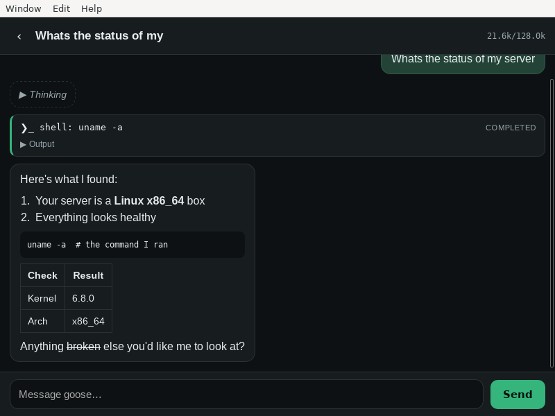
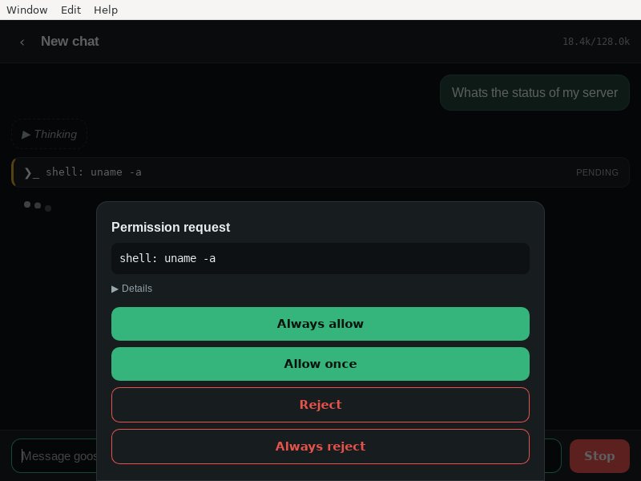
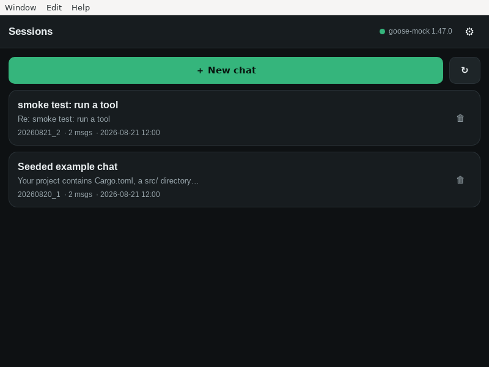
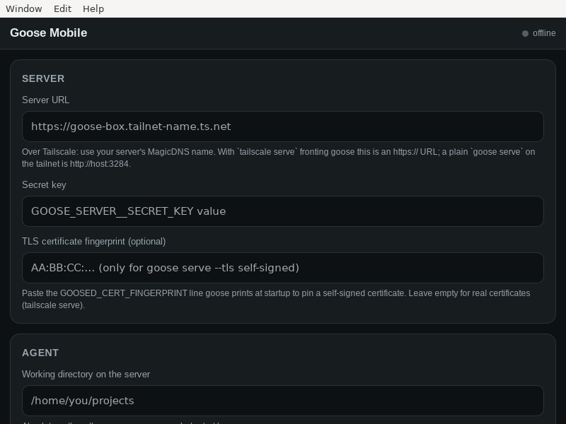

# Goose Mobile

[](https://github.com/PhillipChaffee/goose-phone-app/actions/workflows/ci.yml)
[](https://codecov.io/gh/PhillipChaffee/goose-phone-app)
[](LICENSE)

**Talk to your own [goose](https://github.com/aaif-goose/goose) AI agent from your phone.**

Goose Mobile is a native client for a goose agent running on your own machine — a
home server, a cloud VPS, your desktop. It reaches that server privately over
[Tailscale](https://tailscale.com), so nothing is exposed to the public internet.
Written entirely in Rust with [Dioxus](https://dioxuslabs.com), one codebase builds
for **iOS**, **Android**, and desktop.

<p align="center">
  
  
  
</p>

## Features

- **Full agent chat** — streamed responses rendered as markdown (code blocks, tables, lists), with the agent's reasoning in collapsible sections.
- **Tool visibility and control** — every tool call appears as a card with live status and output, and the agent's permission requests become an approval sheet: allow once, always allow, or reject.
- **Sessions** — browse, resume, and delete your server-side sessions; history replays through the same rendering path as live output, so a resumed chat looks identical.
- **Built for a phone on a flaky network** — Stop cancels a running turn, dropped connections reconnect automatically and replay history, and half-open sockets (the classic "connected but nothing happens" after switching networks) are detected and recovered.
- **Private by default** — reaches your server over your tailnet, authenticated with a shared secret, with optional certificate pinning.

## How it works

```
┌──────────────┐    Tailscale (WireGuard)      ┌──────────────────────┐
│  Your phone  │  wss://goose-box.tailnet…/acp │  Your server         │
│ Goose Mobile │ ─────────────────────────────▶│  goose serve (ACP)   │
│  + Tailscale │   JSON-RPC over WebSocket     │  + tailscaled        │
└──────────────┘                               └──────────────────────┘
```

goose (≥ 1.42) exposes one API: the [Agent Client Protocol](https://agentclientprotocol.com)
— JSON-RPC 2.0 served by `goose serve` at `/acp`. This app speaks it over a
WebSocket, the same transport the official goose Desktop app uses.

The protocol layer lives in [`crates/goose-acp-client`](crates/goose-acp-client): a
UI-independent tokio + tungstenite + rustls library you can reuse in any Rust client.

## Requirements

- A machine to run goose on (any always-on Linux or macOS box) with an AI provider configured
- [Tailscale](https://tailscale.com) on that machine and on your phone — the free tier is plenty
- To build for iOS: a Mac with Xcode. For Android: Android Studio with the NDK

## Quick start

### 1. Run goose as a server

```bash
# Install goose and configure your AI provider once
curl -fsSL https://github.com/aaif-goose/goose/releases/download/stable/download_cli.sh | bash
goose configure

# Start the server. The secret key is the app's password.
GOOSE_SERVER__SECRET_KEY='pick-a-long-random-secret' \
  goose serve --platform desktop --enable-scheduler --host 127.0.0.1 --port 3284
```

### 2. Put it on your tailnet

With Tailscale running on that machine, and **MagicDNS** + **HTTPS Certificates**
enabled in the [admin console](https://login.tailscale.com/admin/dns):

```bash
sudo tailscale serve --bg 3284
```

Your server is now at `https://<machine>.<tailnet>.ts.net` with a real certificate,
reachable only from your tailnet, with goose still bound to localhost.

Verify everything is in the shape the app needs:

```bash
./scripts/check-server.sh
```

It checks the goose process and version, the secret, what address it listens on,
`tailscale serve`, and the HTTP signals that matter — then prints the exact values
to enter in the app.

### 3. Build and install

```bash
curl -sSL https://dioxus.dev/install.sh | bash   # the dx CLI
dx serve --desktop                               # try it on your computer first
```

**iOS** — see [`docs/iphone-setup.md`](docs/iphone-setup.md) for the full walkthrough
(signing is the fiddly part):

```bash
rustup target add aarch64-apple-ios aarch64-apple-ios-sim
dx serve --ios              # simulator
dx serve --ios --device     # your iPhone
dx bundle --ios --release --codesign
```

**Android**:

```bash
rustup target add aarch64-linux-android armv7-linux-androideabi \
                  i686-linux-android x86_64-linux-android
dx serve --android          # emulator
dx serve --android --device # your phone
dx bundle --android         # .aab (--package-types apk for an APK)
```

### 4. Connect

Install Tailscale on your phone, sign in to the same tailnet, turn it on. Then in
the app's settings:

| Field | Value |
| --- | --- |
| **Server URL** | `https://<machine>.<tailnet>.ts.net` |
| **Secret key** | your `GOOSE_SERVER__SECRET_KEY` |
| **Working directory** | an absolute path on the server, e.g. `/home/you/projects` |
| **TLS fingerprint** | leave empty unless you use `goose serve --tls` (see below) |

Tap **Test connection**, then **Save & Connect**.

<p align="center">
  
</p>

## Connection options

| Setup | Server URL | Notes |
| --- | --- | --- |
| `tailscale serve` (recommended) | `https://<machine>.<tailnet>.ts.net` | Real Let's Encrypt certificate, goose stays on localhost |
| goose's own TLS | `https://<host>:3284` | Run `goose serve --tls`; paste the `GOOSED_CERT_FINGERPRINT` it prints into the fingerprint field to pin the self-signed certificate |
| Plain HTTP over the tailnet | `http://<host>:3284` | Works — Tailscale already encrypts the path, and the app's networking is pure Rust so iOS ATS doesn't block it |

## Try it without a server

The workspace ships a protocol-faithful mock of `goose serve`, so you can exercise
every feature with no server and no API key:

```bash
cargo run -p mock-goose-server     # http://127.0.0.1:3285, secret "mock-secret"
```

Point the app at it with working directory `/home/demo`. Prompt keywords: `slow`
streams long enough to try the Stop button, `notool` skips the tool call.

## Development

```bash
cargo check --workspace          # must be warning-free
cargo clippy --workspace --all-targets -- -D warnings
cargo test --workspace           # unit + integration tests
cargo llvm-cov -p goose-acp-client --summary-only   # coverage
dx serve --desktop               # run the app
```

```
├── src/                     # Dioxus app
│   ├── state.rs             #   connection lifecycle, chat transcript folding
│   └── views/               #   Settings / Sessions / Chat + permission modal
├── crates/goose-acp-client/ # ACP protocol library (reusable, UI-independent)
├── crates/mock-goose-server/# fake goose server for testing
├── scripts/check-server.sh  # verify a server is app-ready
└── docs/iphone-setup.md     # iPhone deployment walkthrough
```

The coverage badge measures `goose-acp-client` — the UI-independent half of the
workspace, where the protocol and connection logic live.

## Security

- Prefer `tailscale serve`: tailnet-only exposure, real certificates, goose bound to loopback.
- Use a long random `GOOSE_SERVER__SECRET_KEY`. The app sends it only to the server you configure, and stores it in the app-private data directory.
- Restrict which devices can reach the goose port with [Tailscale ACLs](https://tailscale.com/kb/1018/acls). Note that `tailscale serve` means peers connect on port **443**, not 3284.
- Tool permission prompts are your last line of defense — leave goose in an approval mode for remote use.

## Status

Working and tested against a real `goose serve`, plus a full UI pass against the
mock. Not yet exercised: a production tailnet round-trip from a physical device.
Expect rough edges on first device install — [`docs/iphone-setup.md`](docs/iphone-setup.md)
covers the known ones.

Ideas for next: image attachments, mid-turn steering, session rename/archive,
model switching from the phone, and embedded Tailscale for one-tap onboarding.

## License

MIT — see [LICENSE](LICENSE).
